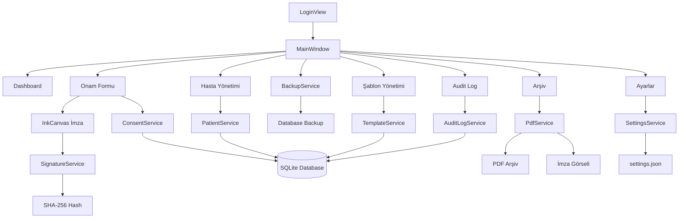
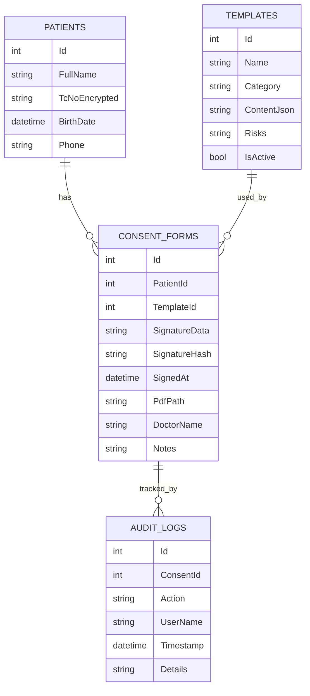
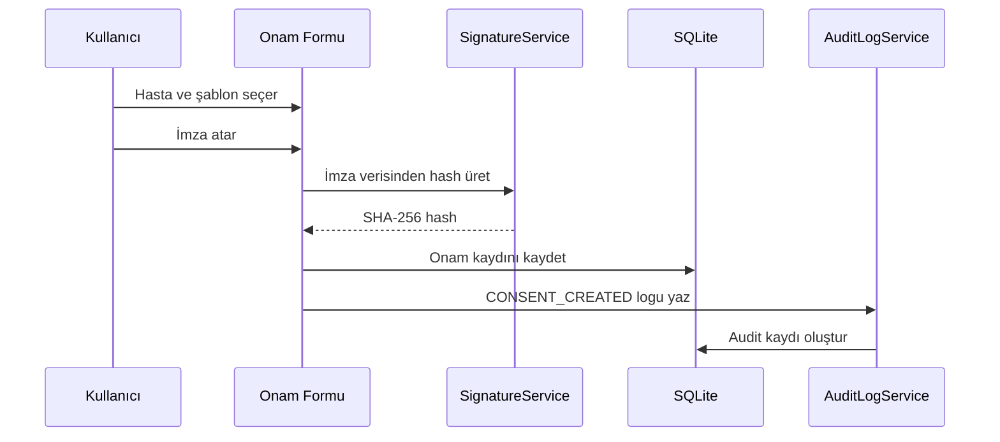
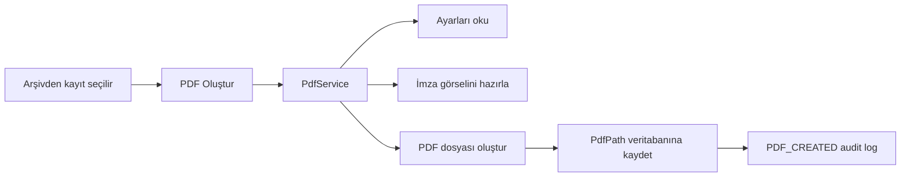
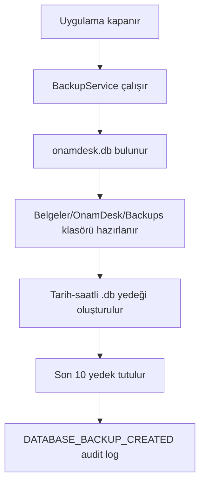

# 🏥 OnamDesk

<div align="center">

## Klinik Onam, Dijital İmza, PDF Arşiv ve Audit Log Sistemi

**OnamDesk**, kliniklerde hasta onam süreçlerini daha güvenli, düzenli, izlenebilir ve offline çalışabilir hale getirmek için geliştirilmiş WPF tabanlı bir masaüstü uygulamasıdır.


</div>

---

## 📌 Proje Özeti

**OnamDesk**, hasta bilgilendirme ve onam formlarını dijital ortamda hazırlamak, hastadan gerçek imza almak, imzalı PDF üretmek, kayıtları arşivlemek ve tüm kritik işlemleri audit log ile takip etmek için tasarlanmış bir klinik masaüstü yazılımıdır.

Uygulama **offline-first** mantıkla çalışır. Yani veriler yerel cihazda tutulur, dış bulut servisine bağımlı değildir. Hasta kayıtları, onam şablonları, imzalı formlar, PDF yolları, sistem logları ve otomatik yedekleme süreçleri uygulama içinde yönetilir.

---

## 🧩 Özellik Widget’ları

| Modül                  |        Durum | Açıklama                                                                      |
| ---------------------- | -----------: | ----------------------------------------------------------------------------- |
| 👤 Hasta Yönetimi      | ✅ Tamamlandı | Hasta ekleme, güncelleme, arama, silme ve doğrulama işlemleri.                |
| 📋 Şablon Yönetimi     | ✅ Tamamlandı | Onam şablonu oluşturma, güncelleme, aktif/pasif yönetimi.                     |
| 📝 Onam Formu          | ✅ Tamamlandı | Hasta + şablon + doktor + not + imza ile onam oluşturma.                      |
| ✍️ Dijital İmza        | ✅ Tamamlandı | WPF InkCanvas ile gerçek hasta imzası alma.                                   |
| 🔐 İmza Hash Doğrulama | ✅ Tamamlandı | İmza verisinden SHA-256 hash üretme ve doğrulama.                             |
| 📄 PDF Üretimi         | ✅ Tamamlandı | İmza, hasta bilgisi, şablon ve hash içeren PDF üretimi.                       |
| 📁 Arşiv               | ✅ Tamamlandı | Onam kayıtlarını listeleme, arama, silme, PDF açma ve hash doğrulama.         |
| 🛡️ Audit Log          | ✅ Tamamlandı | Kritik işlemleri kullanıcı, tarih ve JSON detaylarıyla kayıt altına alma.     |
| ⚙️ Ayarlar             | ✅ Tamamlandı | Klinik adı, doktor adı, kullanıcı adı, PDF başlığı ve arşiv klasörü yönetimi. |
| 🔑 Login Sistemi       | ✅ Tamamlandı | BCrypt şifre doğrulama, hatalı giriş kilidi, şifre değiştirme.                |
| 💾 Otomatik Yedekleme  | ✅ Tamamlandı | Uygulama kapanırken SQLite veritabanını otomatik yedekleme.                   |
| 📊 Dashboard           | ✅ Tamamlandı | Sistem metrikleri, son onamlar ve son audit log kayıtları.                    |

---

## 🖥️ Uygulama Ekranları

### 🏠 Ana Sayfa / Dashboard

Dashboard ekranı klinik sisteminin hızlı özetini verir:

* Toplam hasta sayısı
* Toplam onam kaydı
* PDF oluşturulmuş kayıt sayısı
* Toplam şablon sayısı
* Aktif şablon sayısı
* Toplam audit log sayısı
* Son onam kayıtları
* Son sistem işlemleri

---

### 👤 Hasta Yönetimi

Hasta yönetimi ekranında hasta kayıtları yönetilir.

Desteklenen alanlar:

* Hasta adı soyadı
* TC kimlik numarası
* Doğum tarihi
* Telefon numarası

Öne çıkan noktalar:

* TC kimlik numarası doğrulama
* Telefon format kontrolü
* Aynı TC ile tekrar kayıt engelleme
* Hasta üzerinde onam kaydı varsa silme koruması
* Hasta işlemlerini audit log’a yazma

Audit log action örnekleri:

```txt
PATIENT_CREATED
PATIENT_UPDATED
PATIENT_DELETED
```

---

### 📋 Şablon Yönetimi

Klinikte kullanılan onam şablonları bu ekrandan yönetilir.

Şablon alanları:

* Şablon adı
* Kategori
* Açıklama / içerik
* Risk ve komplikasyonlar
* Aktif / pasif durumu

Öne çıkan noktalar:

* Aynı isimde şablon oluşturma engeli
* Aktif şablonlar Onam Formu ekranında listelenir
* Onam kaydında kullanılmış şablon silinemez
* Tüm işlemler audit log’a yazılır

Audit log action örnekleri:

```txt
TEMPLATE_CREATED
TEMPLATE_UPDATED
TEMPLATE_DELETED
```

---

### 📝 Onam Formu

Onam Formu ekranı dijital onam oluşturma akışının merkezidir.

İş akışı:

```txt
Hasta seç
   ↓
Aktif şablon seç
   ↓
Doktor bilgisi ve not gir
   ↓
Hasta imzası al
   ↓
İmzalı onam kaydı oluştur
   ↓
Arşivde görüntüle
   ↓
PDF oluştur
```

Öne çıkan özellikler:

* Doktor adı Ayarlar ekranındaki varsayılan doktor adından gelir
* Şablon içeriği ve risk metinleri önizlenir
* Hasta imzası `InkCanvas` üzerinden alınır
* İmza verisi Base64 formatında saklanır
* İmza verisinden SHA-256 hash üretilir
* Onam oluşturma işlemi audit log’a yazılır

Audit log action örnekleri:

```txt
CONSENT_CREATED
CONSENT_CREATED_TEST
```

---

### 📁 Arşiv

Arşiv ekranı oluşturulan onam kayıtlarını yönetmek için kullanılır.

Özellikler:

* Onam kayıtlarını listeleme
* Hasta / doktor / şablon bazlı arama
* Seçili onam detaylarını görüntüleme
* İmza hash doğrulama
* PDF oluşturma
* PDF açma
* Onam kaydı silme

Audit log action örnekleri:

```txt
PDF_CREATED
CONSENT_DELETED
```

---

### 📄 PDF Üretimi

PDF içinde bulunan bilgiler:

* PDF başlığı
* Hasta adı soyadı
* Doğum tarihi
* Doktor adı
* İmzalanma tarihi
* Şablon adı
* Kategori
* Açıklama / içerik
* Risk ve komplikasyonlar
* Ek notlar
* Hasta imza görseli
* İmza hash değeri
* Sistem tarafından oluşturuldu bilgisi

PDF özellikleri:

* PDF başlığı Ayarlar ekranından gelir
* Arşiv klasörü Ayarlar ekranından gelir
* Uzun metinlerde otomatik yeni sayfa açılır
* İmza görseli PDF içine eklenir
* PDF yolu veritabanına kaydedilir

---

### 🛡️ Audit Log

Audit Log ekranı sistemdeki kritik işlemleri izlemek için kullanılır.

Kaydedilen bilgiler:

* Action adı
* Kullanıcı adı
* İlgili onam kaydı ID’si
* Tarih / saat
* JSON detay verisi

Audit log örnekleri:

```txt
LOGIN_SUCCESS
LOGIN_FAILED
LOGOUT_REQUESTED
LOGOUT_CANCELLED
LOGOUT_SUCCESS
RELOGIN_SUCCESS
PASSWORD_CHANGED
SETTINGS_UPDATED
PATIENT_CREATED
PATIENT_UPDATED
PATIENT_DELETED
TEMPLATE_CREATED
TEMPLATE_UPDATED
TEMPLATE_DELETED
CONSENT_CREATED
PDF_CREATED
CONSENT_DELETED
DATABASE_BACKUP_CREATED
DATABASE_BACKUP_FAILED
```

---

### ⚙️ Ayarlar

Ayarlar ekranından yönetilen alanlar:

* Klinik adı
* Varsayılan doktor adı
* Aktif kullanıcı adı
* PDF başlığı
* PDF arşiv klasörü
* Uygulama şifresi
* Son yedekler

Öne çıkan özellikler:

* Ayarlar `settings.json` dosyasına kaydedilir
* Klinik ve kullanıcı bilgisi sol menüde anlık güncellenir
* PDF başlığı ve arşiv klasörü PDF üretimine bağlanmıştır
* Şifre değişikliği BCrypt altyapısıyla yapılır
* Son yedekler listelenebilir
* Seçili yedek dosyası Windows Explorer içinde gösterilebilir

---

## 🔑 Güvenlik Özellikleri

| Güvenlik Özelliği   | Açıklama                                               |
| ------------------- | ------------------------------------------------------ |
| Offline çalışma     | Veriler yerel cihazda saklanır.                        |
| BCrypt şifreleme    | Uygulama giriş şifresi hash’lenerek saklanır.          |
| Hatalı giriş kilidi | 5 hatalı girişten sonra geçici kilitleme uygulanır.    |
| Şifre değiştirme    | Ayarlar ekranından uygulama şifresi değiştirilebilir.  |
| İmza hash doğrulama | İmza verisi SHA-256 hash ile doğrulanır.               |
| Audit log           | Kritik işlemler JSON detaylarıyla kayıt altına alınır. |
| Otomatik yedekleme  | Uygulama kapanışında veritabanı yedeği alınır.         |
| TC doğrulama        | Hasta TC kimlik alanı format kontrolünden geçer.       |
| Silme koruması      | Onam kaydı olan hasta veya şablon silinemez.           |

---

## 🧠 Sistem Mimarisi



---

## 🗃️ Veritabanı Diyagramı



---

## 🔄 Onam Oluşturma Akışı



---

## 📄 PDF Üretim Akışı



---

## 💾 Yedekleme Akışı



---

## 🛠️ Kullanılan Teknolojiler

| Teknoloji             | Kullanım Amacı                              |
| --------------------- | ------------------------------------------- |
| .NET 8                | Ana uygulama platformu                      |
| WPF                   | Masaüstü arayüz                             |
| MVVM                  | UI ve iş mantığı ayrımı                     |
| CommunityToolkit.Mvvm | ObservableProperty, RelayCommand, Messenger |
| Entity Framework Core | ORM ve veritabanı erişimi                   |
| SQLite                | Yerel veritabanı                            |
| PdfSharp              | PDF oluşturma                               |
| BCrypt.Net            | Şifre hashleme ve doğrulama                 |
| Newtonsoft.Json       | Settings, auth ve audit detay serileştirme  |
| InkCanvas             | Hasta imzası alma                           |

---

## 📁 Proje Yapısı

```txt
OnamDesk/
├── Data/
│   └── AppDbContext.cs
│
├── Helpers/
│   ├── SettingsUpdatedMessage.cs
│   └── WindowsFontResolver.cs
│
├── Models/
│   ├── Patient.cs
│   ├── Template.cs
│   ├── ConsentForm.cs
│   └── AuditLog.cs
│
├── Services/
│   ├── PatientService.cs
│   ├── TemplateService.cs
│   ├── ConsentService.cs
│   ├── SignatureService.cs
│   ├── PdfService.cs
│   ├── AuditLogService.cs
│   ├── SettingsService.cs
│   ├── AuthService.cs
│   ├── BackupService.cs
│   ├── DashboardService.cs
│   └── EncryptionService.cs
│
├── ViewModels/
│   ├── MainViewModel.cs
│   ├── LoginViewModel.cs
│   ├── DashboardViewModel.cs
│   ├── PatientViewModel.cs
│   ├── TemplateViewModel.cs
│   ├── ConsentViewModel.cs
│   ├── ArchiveViewModel.cs
│   ├── AuditLogViewModel.cs
│   ├── SettingsViewModel.cs
│   └── ViewModelBase.cs
│
├── Views/
│   ├── LoginView.xaml
│   ├── DashboardView.xaml
│   ├── PatientView.xaml
│   ├── TemplateView.xaml
│   ├── ConsentView.xaml
│   ├── ArchiveView.xaml
│   ├── AuditLogView.xaml
│   └── SettingsView.xaml
│
├── Migrations/
├── App.xaml
├── MainWindow.xaml
└── OnamDesk.csproj
```

---

## 🔐 Varsayılan Giriş Bilgisi

İlk çalıştırmada varsayılan şifre:

```txt
onam1234
```

İlk girişten sonra bu şifre **Ayarlar > Güvenlik / Şifre Değiştir** bölümünden değiştirilmelidir.

---

## 💾 Yedekleme

Uygulama kapatıldığında veritabanı otomatik olarak yedeklenir.

Varsayılan yedek klasörü:

```txt
Belgeler/OnamDesk/Backups
```

Yedek dosya formatı:

```txt
onamdesk_backup_yyyyMMdd_HHmmss.db
```

Sistem varsayılan olarak son 10 yedeği tutacak şekilde tasarlanmıştır.

---

## 📊 MVP Budget / Kapsam Planı

| Kapsam                |        Durum | Öncelik |
| --------------------- | -----------: | ------: |
| Hasta yönetimi        | ✅ Tamamlandı |  Yüksek |
| Şablon yönetimi       | ✅ Tamamlandı |  Yüksek |
| Dijital imza          | ✅ Tamamlandı |  Yüksek |
| PDF üretimi           | ✅ Tamamlandı |  Yüksek |
| Audit log             | ✅ Tamamlandı |  Yüksek |
| Login sistemi         | ✅ Tamamlandı |  Yüksek |
| Otomatik yedekleme    | ✅ Tamamlandı |    Orta |
| Dashboard             | ✅ Tamamlandı |    Orta |
| Yedekten geri yükleme |  ⏳ Planlandı |  Yüksek |
| QR doğrulama          |  ⏳ Planlandı |    Orta |
| Excel / CSV export    |  ⏳ Planlandı |    Orta |
| Çoklu kullanıcı / rol |  ⏳ Planlandı |  Yüksek |
| Klinik logo desteği   |  ⏳ Planlandı |   Düşük |
| Tema seçimi           |  ⏳ Planlandı |   Düşük |

---

## 🚀 Gelecek Özellikler

* Arşivden PDF silme / yeniden oluşturma
* Manuel yedek al butonu
* Yedekten geri yükleme sistemi
* Ayarlar ekranında klasör seçici
* Dashboard hızlı işlem butonları
* Dashboard aylık onam grafiği
* Hasta detay ekranı
* Hastaya ait onam geçmişi
* Onam kaydı detay ekranı
* PDF önizleme alanı
* Onam formu yazdırma
* PDF’e QR doğrulama kodu ekleme
* İmza hash doğrulama raporu
* Audit log dışa aktarma
* Hasta listesini Excel / CSV dışa aktarma
* Şablon kopyalama / çoğaltma
* Şablon kategori yönetimi
* Arşiv gelişmiş filtreleme
* Tarih aralığına göre onam arama
* Tema seçimi: açık / koyu
* Oturum zaman aşımı
* Veritabanı sağlık kontrolü
* İlk kurulum sihirbazı
* Klinik logo yükleme
* PDF’e klinik logosu ekleme
* PDF footer: klinik adı, tarih, sayfa numarası
* KVKK / aydınlatma metni hazır şablonları
* Doktor listesi yönetimi
* Çoklu kullanıcı / rol sistemi
* Sistem bakım ekranı
* Hata log dosyası sistemi

---

## ⚠️ Not

Bu proje şu anda MVP / portföy projesi olarak geliştirilmiştir. Gerçek klinik kullanım öncesinde KVKK, mevzuat, veri güvenliği, yedekleme politikası, kullanıcı yetkilendirme ve hukuki onam süreçleri açısından profesyonel değerlendirme yapılmalıdır.

---

## 👩‍💻 Developer

**Pınar Topuz**

* Backend / Full-Stack Development
* .NET, WPF, MVVM, EF Core, SQLite
* Secure local desktop application design
* Clinical workflow automation MVP

---

## 📄 License

This project is currently developed as a portfolio and MVP project.


